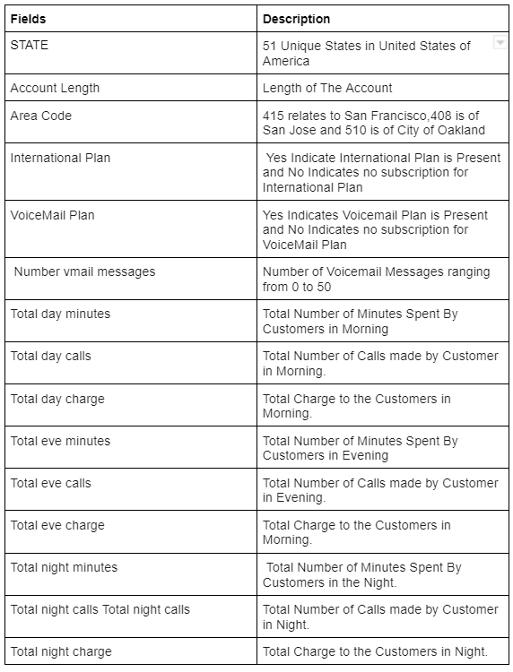
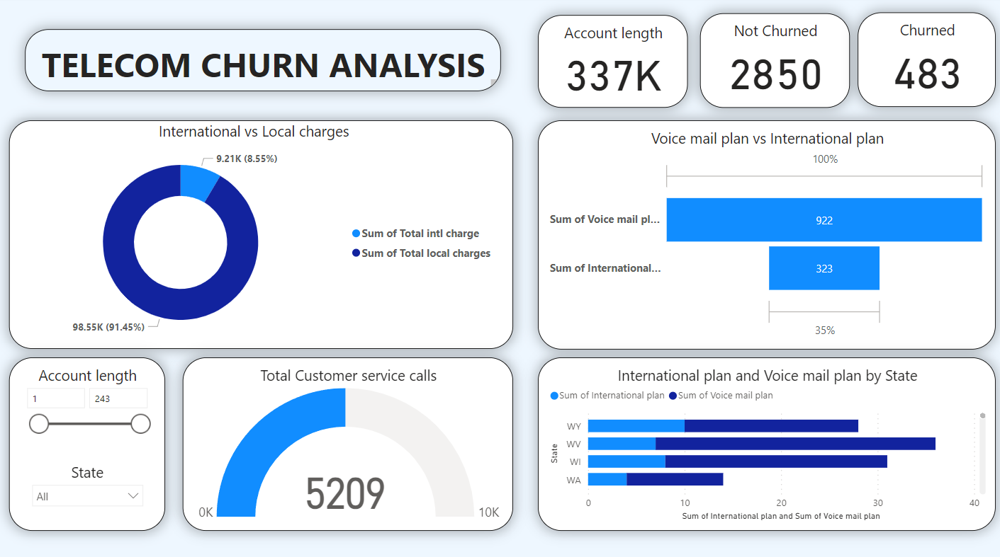
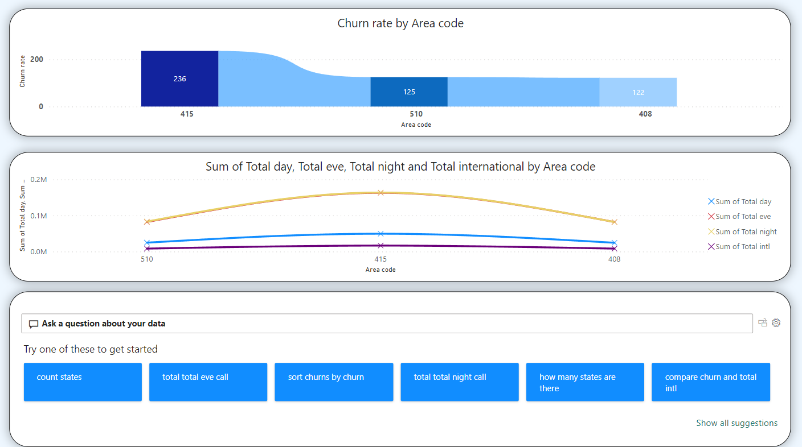

## Telecom churn analysis
[Project:Telecom churn analysis using colab](https://github.com/sumeetbabar2809/Telecom-churn-analysis)

## Telecom Churn Analysis Visualization using PowerBI

## Overview
This repository contains the visualization and analysis of telecom customer churn using PowerBI. The project focuses on providing interactive dashboards to understand and mitigate customer attrition patterns.

## Key Features
- Interactive Visualizations
- Churn Trends Analysis
- Demographic Insights
- Predictive Modeling Visualization

## Getting Started
To explore the analysis and visualizations, download the PowerBI file and run it using PowerBI Desktop.

## Data
extract data from telecom churn analysis link file 

**
import pandas as pd

## Mount Google Drive to access the .ipynb file
from google.colab import drive
drive.mount('/content/drive')

## Load the Jupyter notebook file using Pandas
df = pd.read_json('/content/drive/MyDrive/notebookpath.ipynb')

## Convert the data to CSV
df.to_csv('/content/drive/MyDrive/output.csv', index=False)

## Or convert the data to Excel
df.to_excel('/content/drive/MyDrive/output.xlsx', index=False)
**

## Screenshots

